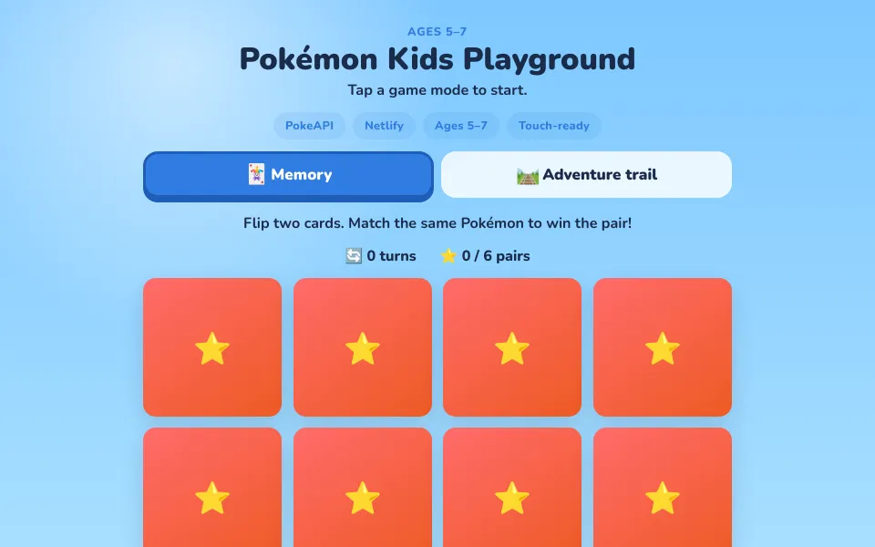

# Pokémon Kids Playground

[](https://pokemon-barnspel.netlify.app/)
[](https://developer.mozilla.org/en-US/docs/Web/HTML)
[](https://developer.mozilla.org/en-US/docs/Web/CSS)
[](https://developer.mozilla.org/en-US/docs/Web/JavaScript)
[](https://pokeapi.co/)
[](https://github.com/Elli2022/pokemon-kids-playground)

A **mobile-first**, touch-friendly Pokémon mini-game for children ages **5–7**. Sibling project to [pokemon-search-app](https://github.com/Elli2022/pokemon-search-app).

Kids match picture cards only — no reading required. A curated roster (Pikachu, Charmander, Eevee, and friends) avoids random obscure species names.

## Screenshot



## Live demo

**[Play on Netlify](https://pokemon-barnspel.netlify.app/)**

> Netlify subdomain: `pokemon-barnspel.netlify.app` (legacy name from the first deploy). The GitHub repo is `pokemon-kids-playground`.

## Game modes

| Mode | Description |
| --- | --- |
| **Memory** | 12 cards, 6 pairs. Flip two at a time until all matches are found. |
| **Adventure trail** | Five stops on a path. Each stop has a 4-card mini memory (2 pairs). Clear a stop to move the buddy forward. |

## Mobile & touch

Built **mobile-first**, then enhanced for larger screens:

- 3-column memory grid on phones, 4 columns from `36rem` up
- Minimum **48×48px** tap targets (tabs, cards, buttons)
- `touch-action: manipulation` and `-webkit-tap-highlight-color: transparent` to reduce tap delay and flash
- `pointerup` handlers with debounce to avoid double-flips on touch
- `safe-area-inset` padding for notched devices
- `100dvh` layout and horizontal scroll on the trail when needed

## Tech stack

| Layer | Choice |
| --- | --- |
| Markup | HTML5 |
| Styles | CSS3 (custom properties, grid, mobile-first breakpoints) |
| Logic | Vanilla JavaScript |
| Data | [PokeAPI](https://pokeapi.co/) (artwork & cries) |
| Hosting | [Netlify](https://www.netlify.com/) — static, no build step |

## Project structure

```text
pokemon-kids-playground/
├── images/
│   └── screenshot.png
├── index.html
├── script.js
├── style.css
├── netlify.toml
└── README.md
```

## Run locally

```bash
git clone https://github.com/Elli2022/pokemon-kids-playground.git
cd pokemon-kids-playground
python3 -m http.server 4173
```

Open [http://localhost:4173](http://localhost:4173). Use your browser’s device toolbar to test touch layouts.

## Deploy on Netlify

1. Import `Elli2022/pokemon-kids-playground` from GitHub.
2. **Build command:** leave empty.
3. **Publish directory:** `.` (repository root).
4. `netlify.toml` sets publish path and security headers.

## Author

**Eleonora Nocentini Skoldebrink** — [@Elli2022](https://github.com/Elli2022)
